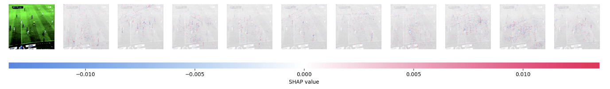
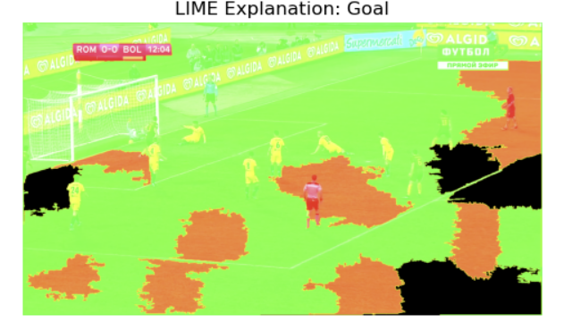

# SoccerNet Event Classification with Explainability

This project applies deep learning techniques to classify soccer events from the [SoccerNet-v2](https://www.soccer-net.org/) dataset using image data. We implemented and compared ResNet-50 and EfficientNet-B3 models, and explored model explainability through LIME and SHAP to interpret predictions and understand model decision-making.

## 📌 Project Goals

- Train convolutional neural networks (CNNs) to classify soccer events (e.g., goal, foul, offside).
- Filter and preprocess image data with limited-label classes for improved performance.
- Apply explainability techniques (LIME and SHAP) to analyze key visual features that drive predictions.

## 🧠 Models Used

- **ResNet-50**  
- **EfficientNet-B3**

## 🔍 Explainability Tools

- **LIME (Local Interpretable Model-agnostic Explanations)**  
  Highlights regions of the image that positively/negatively influenced the prediction.
- **SHAP (SHapley Additive exPlanations)**  
  Offers a model-aware, theoretically grounded view of feature importance.

## 🗂️ Dataset

- **Source**: [SoccerNet-v2](https://www.soccer-net.org/)  
- **Data**: Frame-level images from broadcast footage of professional soccer games.  
- **Labels**: Multi-class labels including goal, foul, offside, and more.  
- **Preprocessing**: Classes with fewer than 100 samples were removed to focus on well-represented event types.

## 🧪 Results

- Both models achieved solid performance on filtered classes.
- SHAP and LIME highlighted meaningful visual regions relevant to specific soccer events.
- The project demonstrated how explainability tools can provide insights into black-box deep learning models in sports analytics.

## 📊 Example Outputs

| Model      | Explainability Tool | Visualization |
|------------|---------------------|----------------|
| ResNet-50  | SHAP                |  |
| EfficientNet-B3 | LIME         |  |

_(Replace the image paths with your actual output visualizations)_

## 📁 Repository Structure

